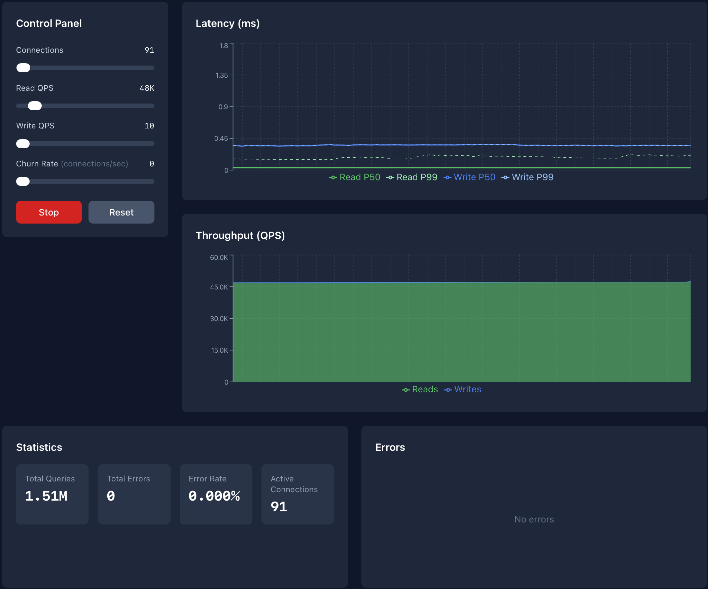

# Firehose 🔥

A load testing UI for Postgres connection poolers with real-time latency and throughput metrics.



## Features

- **Adjustable Load** — Control connections, read QPS, and write QPS with live sliders
- **Real-time Metrics** — Latency (P50/P99), throughput, and error rates streamed via WebSocket
- **High Throughput** — Go backend with goroutines can push tens of thousands of QPS
- **Single Binary** — Frontend embedded via `go:embed`, one binary to run
- **Clean UI** — React dashboard with live-updating charts

## Quick Start

### Prerequisites

- Go 1.21+
- Node.js 18+ (for building frontend)
- PostgreSQL 14+ (or your connection pooler pointing to Postgres)

### 1. Set Up the Database

```bash
psql -h localhost -U postgres -d pooler_demo -f init.sql
```

### 2. Build & Run

```bash
# Build frontend
cd frontend
npm install
npm run build
cd ..

# Build and run
go build -o firehose .
./firehose
```

Open [http://localhost:8080](http://localhost:8080) and start blasting.

## Configuration

Environment variables:

| Variable | Default | Description |
|----------|---------|-------------|
| `DATABASE_URL` | `postgres://localhost:5432/pooler_demo` | Postgres connection string (point this at your pooler) |
| `HTTP_PORT` | `8080` | HTTP/WebSocket server port |
| `MAX_CONNECTIONS` | `500` | Maximum allowed connections |
| `MAX_READ_QPS` | `50000` | Maximum read queries per second |
| `MAX_WRITE_QPS` | `10000` | Maximum write queries per second |

## Architecture

```
┌────────────────────────────────────────────────────┐
│               firehose binary                      │
│                                                    │
│  ┌──────────────────────────────────────────────┐ │
│  │  Embedded React UI (go:embed)                │ │
│  └──────────────────────────────────────────────┘ │
│                                                    │
│  ┌──────────────────────────────────────────────┐ │
│  │  HTTP Server (:8080)                         │ │
│  │  • /*          → Static files                │ │
│  │  • /api/*      → REST endpoints              │ │
│  │  • /ws/metrics → WebSocket stream            │ │
│  └──────────────────────────────────────────────┘ │
│                                                    │
│  ┌──────────────────────────────────────────────┐ │
│  │  Load Generator                              │ │
│  │  • Worker goroutines                         │ │
│  │  • Rate limiting                             │ │
│  │  • Metrics collection                        │ │
│  └──────────────────────────────────────────────┘ │
└─────────────────────────┬──────────────────────────┘
                          │
                          ▼
                 ┌────────────────┐
                 │  Your Pooler   │
                 └───────┬────────┘
                         │
                         ▼
                 ┌────────────────┐
                 │   PostgreSQL   │
                 └────────────────┘
```

See [DESIGN.md](DESIGN.md) for the full technical design.

## Development

```bash
# Terminal 1: Frontend with hot reload
cd frontend
npm run dev

# Terminal 2: Backend (proxies to Vite dev server)
go run . --dev
```

## Workload Details

**Reads** — Random point selects by primary key:
```sql
SELECT id, username, email, created_at FROM users WHERE id = $1
```

**Writes** — Inserts with generated data:
```sql
INSERT INTO users (username, email) VALUES ($1, $2) RETURNING id
```
